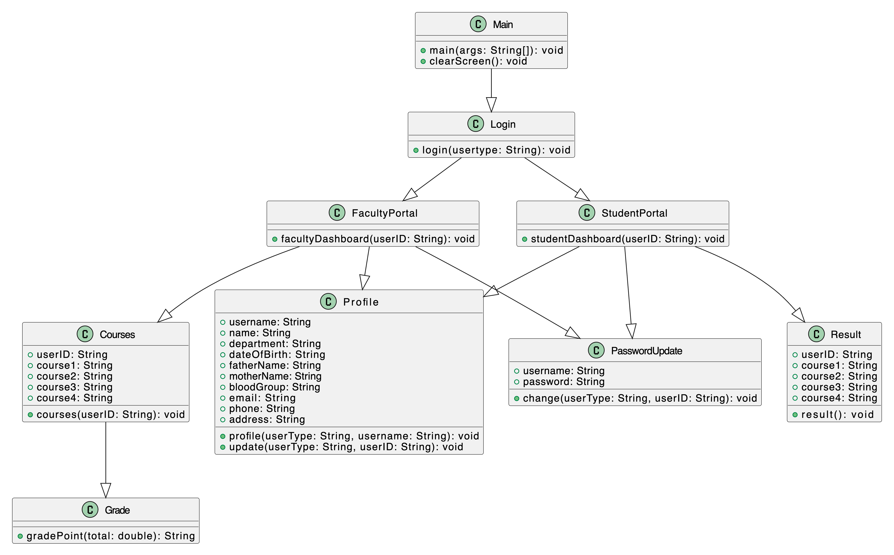

# Core Java Project
## Introduction

### Title

#### University Portal

(Faculty & Student Portal Management System)

### Concept

Users can log in using password.

Users can view and update their profile and password.

The portal will help faculty members to easily add mark in the course and  see result of all students in the course.

Students can view their result for every course in one place.

## Features
This University Portal mainly have two parts

* Faculty Portal

* Student Portal

#### Faculty Portal
1. Profile
2. Profile Update
3. Password Change
4. Courses
4. * Mark Input
5. Logout

#### Student Portal
1. Profile
2. Profile Update
3. Password Change
4. Result
5. Logout

## Use Case Diagram

## Class Diagram

## Activity Diagram

[Java Project Proposal.pdf](..%2F..%2F..%2FDownloads%2FJava%20Project%20Proposal.pdf)
